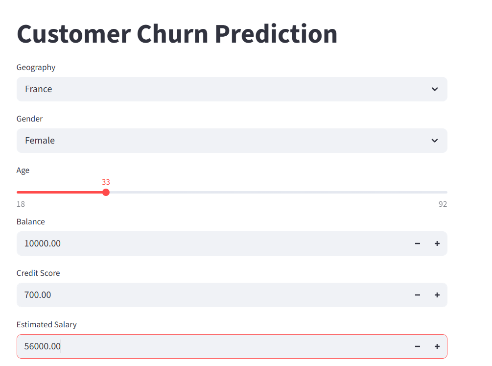
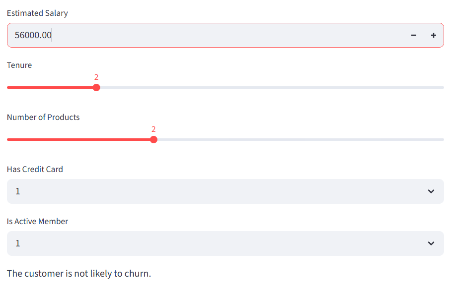

# ANN
## 🚀 Live Demo
You can try out the ANN Classifier live here: https://ritwik-ann-churn.streamlit.app/

## 🛠️ Tech Stack
* **Language:** Python
* **Deep Learning:** TensorFlow / Keras
* **Data Manipulation:** Pandas, NumPy, Scikit-learn
* **Frontend/Deployment:** Streamlit
* **Environment:** Streamlit Cloud

* This project uses an **Artificial Neural Network (ANN)** to predict whether a customer is likely to leave a bank (Churn) based on their demographics and transaction history.

🏗️ Model Architecture
The app is powered by a multi-layer Sequential Artificial Neural Network (ANN). The structure is designed to take raw customer data and transform it through hierarchical layers to predict churn probability:

Input Layer: The model accepts an input vector of 11 features (after dropping non-predictive columns like RowNumber and CustomerId). This includes processed numerical data and encoded categorical variables.

First Hidden Layer: A Dense (Fully Connected) layer consisting of 64 neurons. It uses the ReLU (Rectified Linear Unit) activation function to introduce non-linearity, allowing the model to learn complex relationships between features like Age, Balance, and Credit Score.

Second Hidden Layer: A Dense layer with 32 neurons, also using ReLU activation. This layer further refines the features extracted by the first layer, reducing dimensionality while retaining the most predictive information.

Output Layer: A final Dense layer with a single neuron and a Sigmoid activation function. This configuration is essential for binary classification as it "squashes" the output into a probability value between 0 and 1, where values closer to 1 indicate a higher likelihood of the customer exiting the bank.

* []

* APP URL:- https://ritwik-ann-churn.streamlit.app/

* ### 🖥️ App Preview
| User Input Interface | Prediction Result |
| :---: | :---: |
|  |  |
